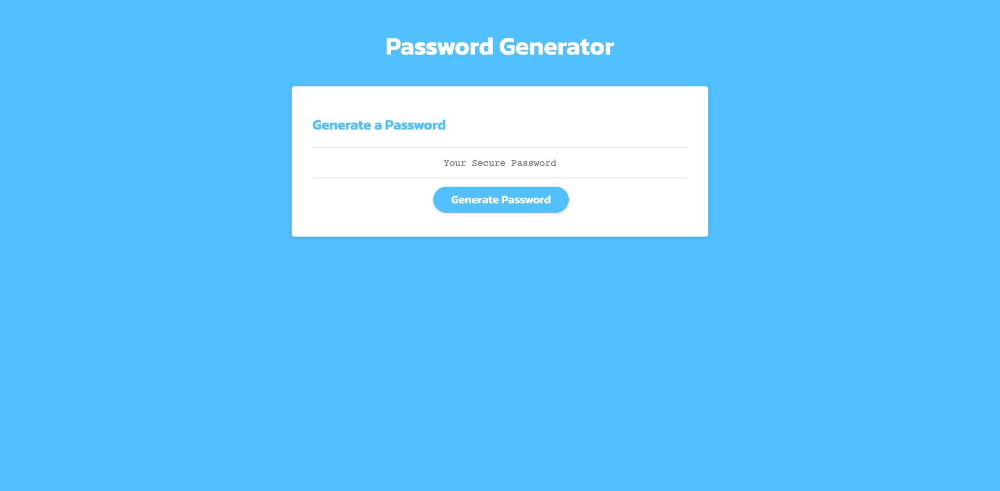
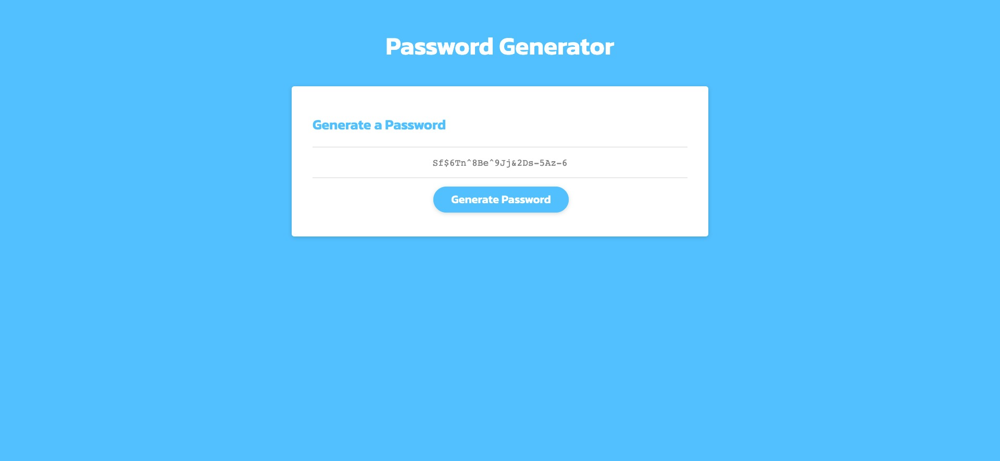

# Javascript Random Password Generator
A random password generator built using JavaScript, CSS, and HTML

## Description

This challenge tested my knowledge of JavaScript variables, arrays, functions, and more, in order to develop a website that would generate a random password based on user-provided criteria.

## Links

[**Week Three Challenge**](https://mbartnett.github.io/JavaScript-Random-Password-Generator/) 
[**Week Three Challenge Repo**](https://github.com/mbartnett/JavaScript-Random-Password-Generator)

## Screengrabs

## License

Please refer to the LICENSE in the repo.